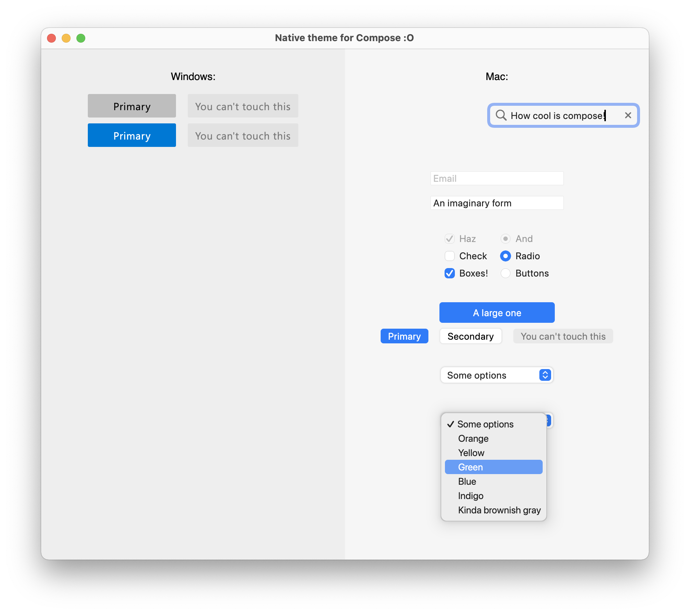

# MacOS theme for Compose
Multiplatform MacOS theme written in Compose UI.

Create native looking UIs for Mac using Compose UI. Share your UI code to run on Android, Windows or Linux. 
You could combine this with themes to match other platforms and write your UI once, but themed to appear native.




### Gradle
#### Multiplatform
Add the common dependency which will work for both android and desktop.
```kotlin
sourceSets {
    named("commonMain") {
        dependencies {
            implementation("io.github.chozzle:compose-macos-theme:0.3.1")
        }
    }
}
```

Optionally, supply specific dependencies:

#### Desktop JVM
Currently it appears that for desktop projects, you must use the kotlin multiplatform plugin
```kotlin 
plugins {
    kotlin("multiplatform")
    id("org.jetbrains.compose")
}

kotlin {
    sourceSets {
        named("jvmMain") {
            dependencies {
                implementation(compose.desktop.currentOs)
                implementation("io.github.chozzle:compose-macos-theme-desktop:0.3.1")
            }
        }
    }
}
```

#### Android
Do not specify android specifically (it won't work). Gradle will automatically import the android sourceset only.
```kotlin 
dependencies {
    implementation("io.github.chozzle:compose-macos-theme:0.3.1 ")
}
```

Ensure you have the [required compiler options for compose](https://developer.android.com/jetpack/compose/setup#configure_gradle) generally 
or alternatively you can use Jetbrains' plugin:
```kotlin
plugins {
    id("org.jetbrains.compose")
}
```

You'll need Maven Central as a repository

```kotlin
repositories {
    ...
    mavenCentral()
}
```

### Planned work - please assign yourself!
- [x] Search field
- [x] Text field
- [x] Checkbox
- [x] Buttons
- [x] Dropdown menu - desktop only
- [x] Radio button
- [ ] Switch
- [ ] Dark theme
- [ ] Theme for Windows?

Note that SF Symbols used in this library are only licenced to be used on Apple devices.
